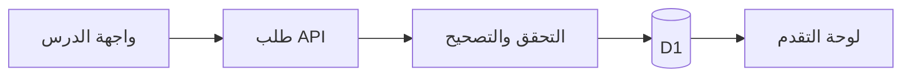

# تعلّم بناء CyberLab

هذا الدليل يبدأ من الصفر. CyberLab تطبيق ويب مكتوب بـ TypeScript وReact. لغة Python نفسها مادة دراسية داخل المنصة؛ أمثلة Python للقراءة والتوقع، ولا تُنفذ على خادم المستخدم.

## الصورة الكبيرة

المتصفح يعرض الدروس والاختبارات. عندما تُكمل درسًا أو تحفظ ملاحظة يرسل طلبًا إلى واجهة برمجية داخل التطبيق. الخادم يتعرف إلى المستخدم من هوية ChatGPT الموثوقة، يتحقق من البيانات، ثم يحفظها في قاعدة D1. لذلك لا يصبح تغيير رقم على الشاشة إنجازًا حقيقيًا.

## خريطة الملفات

| الملف أو المجلد | وظيفته |
| --- | --- |
| `app/layout.tsx` | غلاف الصفحات، اللغة والهوية |
| `app/shell.tsx` | القائمة المشتركة، الحساب، تحميل حالة التقدم |
| `app/page.tsx` و`app/dashboard.tsx` | لوحة التحكم والاستمرار من آخر درس |
| `app/learn/` | فهرس البحث، عرض الدرس، الاختبار، الملاحظات والإشارات |
| `app/roadmap/page.tsx` و`lib/paths.ts` | رحلات التعلم الست وربطها بالمسارات |
| `app/labs/` | فهرس المحاكاة وصفحاتها، ومنها الطرفية الافتراضية |
| `app/progress/`, `app/profile/`, `app/achievements/`, `app/history/` | التقدم والملف والشارات والتاريخ |
| `app/settings/`, `app/notifications/` | الهدف اليومي والمظهر وإنجازات الحساب |
| `app/api/submit/route.ts` | تصحيح الاختبارات والمختبرات وحفظ الإنجاز |
| `app/api/learning/route.ts` | قراءة نشاط التعلم وحفظ الملاحظات والإعدادات |
| `app/api/progress/route.ts` | قراءة النقاط القديمة والمتوافقة مع النسخ السابقة |
| `lib/curriculum.ts` | 28 درسًا أصليًا، دمج المنهج الموسع والمختبرات |
| `lib/expanded.ts` | بيانات 192 درسًا إضافيًا: المفهوم والمثال والمستوى |
| `lib/answer-key.ts` و`lib/grading.ts` | مفاتيح الأسئلة الأصلية والتصحيح على الخادم |
| `lib/extra-labs.ts` | سيناريوهات التدريب الاصطناعية |
| `lib/metrics.ts` | احتساب الإكمال والوقت والسلسلة والشارات من البيانات |
| `lib/storage.ts` و`db/schema.ts` | استعلامات D1 والجداول؛ `drizzle/` ترحيلات قاعدة البيانات |
| `app/globals.css` | ألوان التصميم وتخطيط الكمبيوتر والجوال |
| `tests/` | فحوص التصحيح وحفظ البيانات والصفحات |
| `docs/AUDIT.md` | نتائج التدقيق وما عولج وحدود المرحلة |

## جرّب تتبع زر «تصحيح إجاباتي»

1. في `app/learn/advanced-quiz.tsx` تحفظ React الإجابات مؤقتًا في `useState`، ثم ترسلها إلى `/api/submit`.
2. `app/api/submit/route.ts` يرفض طلبًا غير صالح أو من أصل غير مسموح، ويستدعي `gradeQuiz`.
3. `lib/grading.ts` يحدد الحل من نوع السؤال؛ لا يثق بدرجة يرسلها المتصفح.
4. إذا اجتاز المستخدم سؤالين من ثلاثة، تحفظ `saveProgress` النقاط مرة واحدة، وتسجل `recordActivity` إكمال الدرس. تُحفظ المحاولة أيضًا للتاريخ.
5. يعيد التطبيق قراءة الحالة، فتتغير لوحة التحكم والشارات والنسبة. يمكن إعادة الاختبار دون مضاعفة XP.

## كيف تضيف درسًا؟

إذا كان المسار موجودًا، أضف سطرًا في بيانات `lib/expanded.ts` بالحقول: العنوان العربي، المصطلح الإنجليزي، التعريف الدقيق، والمثال العملي. كل أربعة أسطر تمثل مستوى واحدًا ضمن وحدة. لكل درس يظهر شرح ومثال وتطبيق ومصطلح وخلاصة وثلاثة أسئلة. راجع صحة المعلومة وأمثلتها، ثم حدّث الاختبارات عند تغيير عدد الدروس. لا تضع كلمة «قريبًا» بدل شرح حقيقي.

إذا احتجت سؤالًا متخصصًا يتجاوز الأنماط الموجودة، عدّل بناء السؤال في `expanded.ts` والتصحيح المقابل في `grading.ts` معًا. تذكر أن الدرجة تُحسب في الخادم. الأسئلة الأصلية ما زالت مرتبطة بـ `answer-key.ts` حتى لا نفقد التقدم السابق.

## كيف تحفظ بيانات جديدة؟

عرّف جدولًا في `db/schema.ts`، ثم ولّد ترحيلًا جديدًا بأمر `pnpm db:generate`. لا تعدّل ترحيلًا سبق نشره. أضف استعلامًا مجهزًا في `lib/storage.ts` يقيّد القراءة والكتابة بـ `userId`. أضف مدخل API يتحقق من الهوية ونوع البيانات وحدود طولها، ثم اعرض حالة التحميل والخطأ في الواجهة. مثال الملاحظات في `app/api/learning/route.ts` و`app/learn/lesson-tools.tsx`.

## تجربتك الأولى كمطور

1. غيّر مثال مفهوم في `lib/expanded.ts` ثم افتح الدرس في الفهرس وابحث عنه.
2. اقرأ `lib/metrics.ts`: لاحظ أن إكمال المسار يُحسب من معرفات دروس محفوظة، لا من رقم ثابت.
3. أضف سؤالًا تجريبيًا وتأكد من تفسير الخطأ بعد التصحيح.
4. شغّل فحوص TypeScript واختبارات المنطق ثم اختبر زرًا واحدًا في المتصفح.

## السلامة والحدود

جميع عناوين IP والرسائل والسجلات في المختبرات أمثلة تدريبية. الطرفية قائمة أوامر مفسرة داخل React؛ لا تنفذ أوامر على جهاز أو خادم. لا تضع كلمات مرور حقيقية في أي تمرين. حساب CyberLab يستخدم تسجيل الدخول عبر ChatGPT، والنسخة المنشورة خاصة بمالك المشروع. قياس وقت القراءة تقريبي ويتوقف عند إخفاء الصفحة، والشارات مشتقة من بيانات الحساب.

## لماذا صار زر «بدء التحدي» رابطًا؟

عندما يفتح المتصفح صفحة جديدة، يظهر HTML قبل أن ينتهي React من تجهيز الأحداث. زر يعتمد على `onClick` و`useState` وحدهما قد يبدو حاضرًا لكنه لا يستجيب لضغطة مبكرة. في `app/labs/[id]/launcher.tsx` يضع المتصفح الآن عنوانًا حقيقيًا في `<a href="...?...&start=1">`. عند فتح هذا العنوان يقرأ `app/labs/[id]/page.tsx` معرّف المختبر و`start`، ويتحقق من وجود المختبر قبل عرض المحاكاة. هكذا يمكن بدء المهمة حتى إذا تأخر JavaScript. الاختبار العملي نفسه في `view.tsx` أو `challenge.tsx`، والنتيجة تحفظ عبر `/api/submit` ثم تعود إلى المسار.

| الملف الجديد | فائدته للمبتدئ |
| --- | --- |
| `app/paths/[id]/page.tsx` و`view.tsx` | صفحة الرحلة؛ تقرأ `pathId` وتعرض المسارات المرتبة ونسبة الإكمال الفعلية. |
| `app/tracks/[id]/page.tsx` و`view.tsx` | صفحة المسار؛ تقرأ `trackId` وتعرض المستويات والدروس والتحديات المناسبة. |
| `lib/navigation.ts` | بناء وجهات الروابط وخريطة ربط كل مختبر بمسار أو أكثر؛ اختبارها في `tests/navigation.test.mjs`. |
| `app/labs/[id]/launcher.tsx` | شاشة المهمة وزر بدء برابط أصلي ثم رابط رجوع إلى المسار أو قائمة المختبرات. |
| ملفات `loading.tsx` و`error.tsx` و`not-found.tsx` داخل المسارات الديناميكية | حالات انتظار وإعادة محاولة ورسالة واضحة إذا كان المعرّف غير موجود. |
| `tests/worker.test.mjs` | يفتح جميع معرّفات الدروس والمسارات والمختبرات والرحلات على Worker حقيقي، ويتحقق من حفظ نتيجة مختبر دون تكرار النقاط. |

إذا أضفت تحديًا جديدًا، أضف بياناته إلى `lib/extra-labs.ts` ومفتاح ربطه بمسار حقيقي في `lib/navigation.ts`. ثم شغّل اختبارات `navigation.test.mjs` و`worker.test.mjs`: ستكشف معرّفًا غير موجود قبل ظهور بطاقة مضللة للمستخدم.
