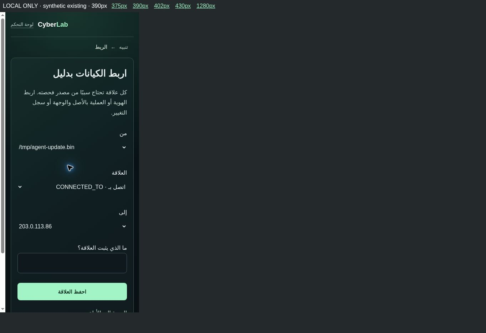
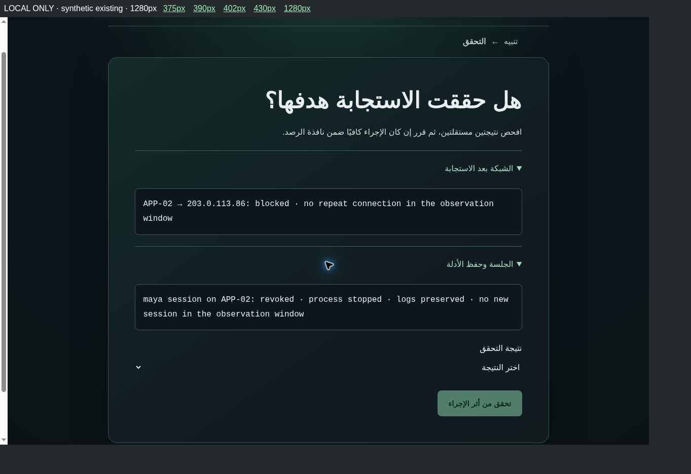
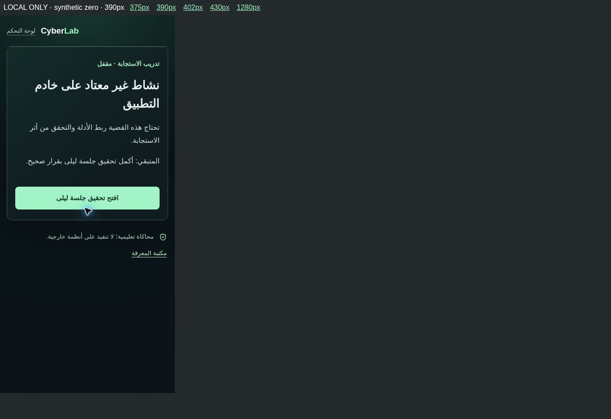
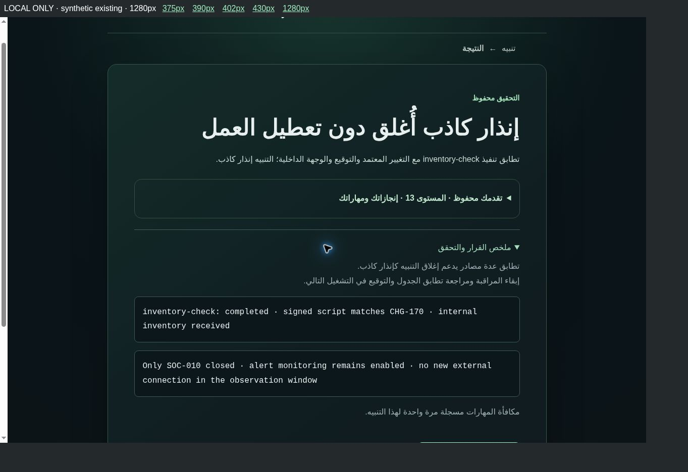

# Defensive Security & SOC Expansion v2 — Candidate review

Development baseline: Version 59 Candidate, commit 47bbf21dc0aff18e5294abe8c06000564436c65f.
Production remains Version 55. No deployment, Authentication changes, D1 migration, hosting/security changes, or Beta Gate status changes.

## Scope and implementation

Two adapters extend existing alerts, not a second incident engine:

| Case | Existing sources | Learning and response |
| --- | --- | --- |
| SOC-004, APP-02 / maya | SOC-004 file, process, authentication; SOC-005 network flow and socket owner | Correlate five evidentiary sources; distinguish file quarantine from containment; isolate host and revoke session while preserving logs; verify network and identity results; retain root-cause follow-up. Flow volume cannot establish exfiltrated content. |
| SOC-010, APP-01 | Existing task definition, CHG-170 and internal network destination; existing signature/history tools | Correlate task, approval and destination; distinguish a false positive from an attack; close only the scoped alert, preserve legitimate inventory and monitoring; verify service and monitoring. |

The phase loop is alert, triage, review/collect, correlate, assess, respond, verify, report, result. Wrong hypotheses return to investigation without a closed state or answer-key feedback. Incomplete or disruptive response returns to response planning; observations differ by the simulated action.

Evidence Locker and Board use the existing user-scoped investigation tables. New board IDs are soc-SOC-004 and soc-SOC-010; original SOC IDs and completion/reward sources are unchanged. Phase/response/verification state lives in optional fields in the existing SOC session JSON. Board and SOC closure and existing Skill XP award statements are committed in the same existing D1 batch. The Board's direct decision action cannot bypass response verification in these two adapters.

Unlock: a correctly completed SOC-002, or an already completed legacy target alert. Legacy results are displayed as historical results and are not falsely labeled as response-verified. Previously completed targets retain access on replay. Classic SOC views and existing investigations remain available. General XP, Skill XP award amounts, Mastery/Career/Rank formulas, entity IDs and old completion records were not rewritten.

Progression reuses the current completion summary and existing soc-response / investigator / correlation achievements. No extra XP source or achievement engine was created. Replay and simultaneous completion keep the original per-alert Skill XP ledger protection.

## Knowledge and lesson notes

Knowledge Cards appear inside relevant inspected evidence or response planning; they are collapsed and brief. References reuse soc-2, soc-3 and security-11, with a validated return_to preserving the SOC step. No lessons were rewritten or added.

The existing lesson tool saves private user notes through /api/learning. It was retained under a collapsed “إرسال ملاحظة” at the end of lesson tools, with explicit copy that it is stored as a private lesson note. This is not a new staff-feedback service. Saving and restoring after Refresh was verified through the browser.

## Validation

- Final build: PASS (npm run build).
- Final Type Check: PASS (tsc --noEmit).
- Regression scripts: 35/35 PASS, including all 34 previous scripts and soc-expansion.test.mjs.
- New integration tests use a disposable Miniflare D1 database and synthetic accounts, not Production credentials/data.
- Tests cover unknown/invalid actions, auth guard, prerequisite/API lock, concealed raw evidence before review, duplicate collection, invalid links, multiple-source correlation, wrong hypothesis, direct Board closure rejection, response/verification/report order, incomplete and disruptive response retries, same-batch completion, persisted state after Worker restart, replay/concurrent Skill XP protection, unchanged existing general XP, achievement integration, local account isolation and legacy-target compatibility.
- Browser: real Chrome UI interaction on the local built Worker through a development-only synthetic-identity harness. Both cases were completed through decisions, bad-response retry, verification, report and result. Refresh and knowledge-lesson return were exercised. Zero-progress account saw the lock and actionable prerequisite; no zero-user prerequisite bypass was used.
- Responsive frames: 375, 390, 402, 430 and 1280 px. Evidence/relationship form inspected visually and by DOM measurements. Final relationship-form scroll width equaled available viewport width at every size, RTL root remained intact, technical file selections were LTR. No visible tested button/select/input/summary was below 40 px in height. The narrow iframe reserves 15 px for a desktop scrollbar, so its available content width is slightly narrower than its frame width.
- Visual issues fixed during QA: phase-indicator contrast, natural evidence count wording and technical file-path direction in entity selectors.

## Limits

No real iPhone/Safari, iOS keyboard/touch, Production OAuth, live Production A/B session isolation, WAF/rate-limit configuration, or backup restore was tested. Local authenticated test headers are part of the existing development-only harness and are not proof of Production authentication. Full browser journeys were run before the final entity-select direction-only correction; the corrected build was subsequently rebuilt, type-checked, regression-tested and visually verified in all five sizes, including evidence collection and lesson-note save/Refresh/return.

Production Beta Gate keeps its previous evidence/status: user-reported OAuth and iPhone/Safari PASS; Production isolation, WAF/rate limiting and separate restore proof remain BLOCKED. Candidate-only testing does not promote these entries to PASS.

## Main files

- lib/soc-expansion.ts and soc-expansion-ui.ts: case/response definitions and small presentation helpers.
- lib/soc-expansion-access.ts: existing prerequisite/legacy access checks.
- lib/soc-engine.ts and soc-storage.ts: optional response flow, authoritative board validation and atomic completion.
- lib/investigation-board.ts, investigation-storage.ts, investigation-relationships.ts: new definitions and reuse of existing collection/link persistence.
- lib/request-validation.ts and existing SOC/investigation routes: strict validation of new actions and safe feedback.
- app/soc/alerts/[id]/defensive.tsx, SOC route/queue, investigation route, focused shell and scoped CSS.
- app/learn/[id]/page.tsx and lesson-tools.tsx: return context and retained collapsed private notes.
- tests/soc-expansion.test.mjs: new integration coverage.

## Visual evidence

