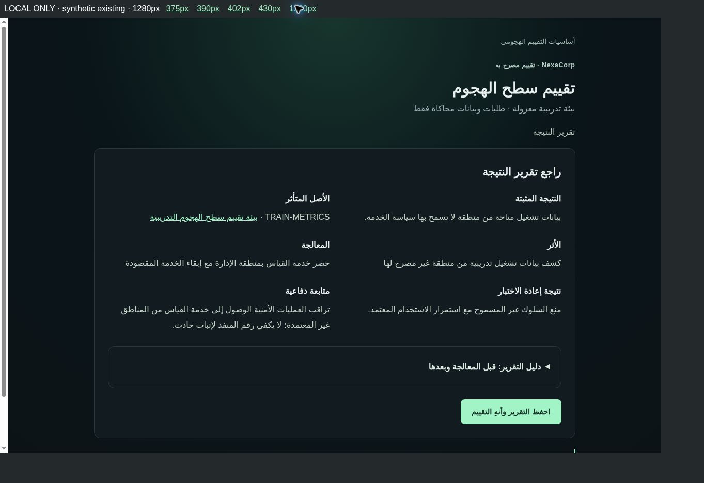
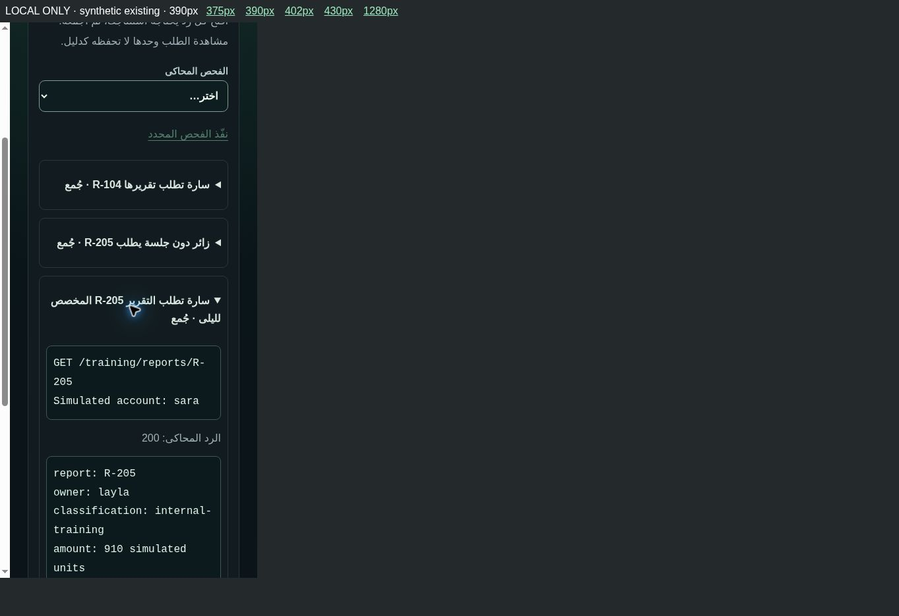
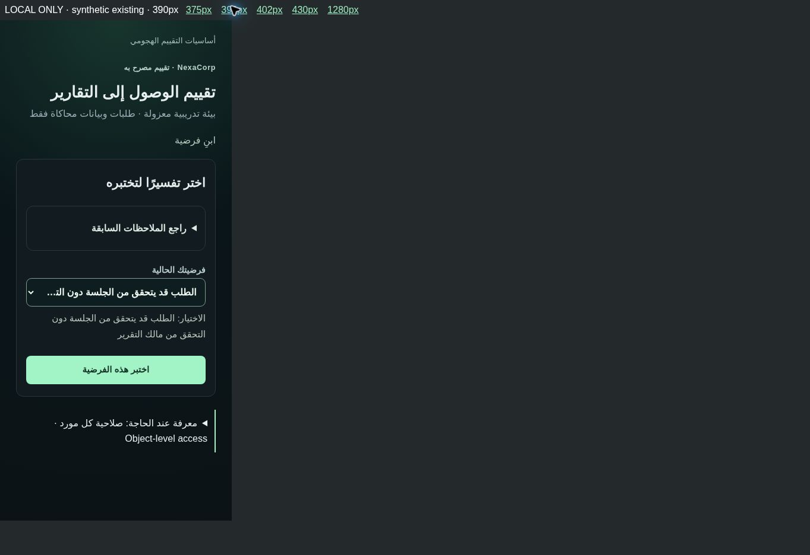

# Offensive Security v2 — تقرير المراجعة

توسعة تطويرية فوق Version 60 Candidate. لا نشر إلى Production؛ تبقى Version 55. لا تعديل لحالة Beta Gate، ولا بدء للمرحلة التالية.

## قبل / بعد

| الجانب | قبل | بعد |
|---|---|---|
| التفويض | إقرار بنطاق مكتوب | يحدد المتعلم الأصول بنفسه؛ الخادم يرفض إدراج WEB-01 أو أهداف حرة |
| الدليل | المشاهدات تُحفظ تلقائيًا | فتح الرد ثم جمعه صراحة؛ مشاهدة الطلب لا تكفي لاعتماد النتيجة |
| الفرضية | موجودة في الوصول والجلسات | فرضية ومقارنة مستقلة أيضًا في تقييم سطح الهجوم |
| النتيجة | Finding وImpact | أصل متأثر محدد، أثر محدود بما تثبته ثلاثة مصادر، وأدلة مجموعة |
| المعالجة | خيار ثم إعادة اختبار | ردود فعلية من المحاكاة، وحكم المتعلم على نجاحها مع استمرار الاستخدام المصرح |
| التقرير | ملخص إكمال | تقرير قصير قابل للمراجعة قبل الإكمال، مع الأدلة قبل/بعد ومتابعة دفاعية |

## التقييمات الثلاثة نفسها

| التقييم / ID المحفوظ | ما يمارسه المتعلم | المقارنات المطلوبة | معيار Retest |
|---|---|---|---|
| Attack Surface — v2-attack-surface | اكتشاف الخدمات، فصل وجود خدمة عن ثغرة، مقارنة سياسة التعرض بالمناطق | سجل السياسة + طلب خارجي + طلب داخلي | خارجي 403؛ داخلي 200؛ البوابة المقصودة 200 |
| Access Control — v2-access-control | التمييز بين جلسة صالحة وصلاحية قراءة مورد | المالك + بلا جلسة + حساب غير مالك | المالك 200؛ بلا جلسة 401؛ غير المالك 403 |
| Authentication & Session — v2-auth-session | مقارنة الثقة في جلسة قديمة بعد الخروج بجلسة جديدة | جلسة A السابقة + جلسة B الجديدة + بلا جلسة | القديمة 401؛ الجديدة 200؛ بلا جلسة 401 |

لا تقييم رابع، ولا Scanner أو Shell أو URL/IP حر أو بيانات دخول حقيقية. النطاق ثابت ومصرح؛ جميع الردود من بيانات المحاكاة الحالية.

## التدفق والتنفيذ

تفويض عملي → استكشاف محدود → ملاحظة → فرضية → اختبار وجمع → مقارنة → أصل/أثر مدعومان → معالجة → Retest → حكم وتقرير → تقدم.

الفرضية غير المدعومة تعرض ملاحظة تناقضها وتتيح إعادة الفحص. لا تقدم الإجابة الصحيحة تلقائيًا. إغلاق كل الخدمات لا يُعتمد كإصلاح إذا عطل الاستخدام المقصود. لا يستطيع طلب API تجاوز جمع الأدلة، أو اعتماد تقرير قبل إجراء المقارنات بعد الإصلاح.

المراجع الحالية للمنافذ وHTTP والمصادقة والتفويض والجلسات وتقليل التعرض تظهر كبطاقات قصيرة مطوية في موضع الحاجة. الدرس الكامل اختياري؛ رابط العودة يعيد التقييم إلى المرحلة المحفوظة. لم تُعد كتابة الدروس، وعنصر «إرسال ملاحظة» بقي كما هو.

## ما أُعيد استخدامه

- LabSession، API المختبرات الحالية، المحولات الخاصة بالتقييمات الثلاثة، تخزين JSON في السجل الحالي.
- الأصول المعزولة الموجودة في NexaCorp: surface-training وaccess-training وsession-training؛ سارة وليلى وهوياتهما الحالية. لا Asset أو Entity ID جديد.
- المحتوى والطلبات والردود والمعالجة والخيارات والمراجع الموجودة.
- شروط Unlock الحالية وملخص التقدم وإنجاز offensive-foundations وحماية المكافآت القائمة.

الامتداد الاختياري `offensive` داخل LabSession يضيف: version، scope، scopeApproved، collected، affectedAsset، reportReady، retestVerdict. لا Engine أو جدول/ledger موازٍ، ولا Migration. ملف checks مشترك تستخدمه المحولات الحالية فقط.

## الربط الدفاعي

التقرير يحدد متابعة مناسبة لما ثبت: مناطق الوصول للخدمة، أو هوية الحساب/مالك المورد/قرار التفويض، أو زمن الخروج وقبول الجلسة. هذه متابعة تعليمية مرتبطة بالدليل؛ لا يولّد SOC Incident جديدًا ولا يعدل قضايا Version 60 أو Investigation Board/Evidence Locker القديمة. أدلة التقييم تستخدم حالة المختبر الموجودة، ولا تُنسخ إلى مخزن مستقل.

## Progress والتوافق

لا تغيير في XP أو Skill XP أو Mastery أو Career أو Rank أو شروط Unlock. الإكمال يستخدم نفس IDs ونفس المسار Server-side للمكافأة الفريدة. الإنجاز الحالي يستند إلى إكمال التقييمات الحالية؛ لا إنجاز إضافي أو مكافأة فوق إعادة التقييم.

المحاولات القديمة التي تحمل حالة قديمة تستمر في واجهتها الحالية. المستخدم الذي أكملها يستطيع اختيار التقييم الموسع صراحة، ويبقى completedAt والمكافأة السابقة محفوظين. أضيفت قيمة افتراضية لعدد المحاولات فقط عند تهيئة الامتداد لسجل قديم مختصر؛ اختبرنا هذا التوافق على Worker/D1 محلي.

## نتائج التحقق

- Build: PASS (`npm run build`).
- Type Check: PASS (`npx tsc --noEmit`).
- Regression: **36/36 PASS**؛ 35 اختبارًا سابقًا + اختبار توسعة جديد.
- الاختبار الجديد يعمل على Worker المبني وقاعدة D1 محلية مؤقتة، وليس Unit checks فقط.
- مستخدم صفري: قفل واضح ومتطلبان صحيحان؛ بدء API مرفوض دون شروطه.
- مستخدم جديد مستوفٍ للشروط: إكمال التقييمات الثلاثة واحتساب مكافآتها الأولى وفق النظام الحالي.
- مستخدم ذو تقدم سابق وسجل مكتمل مختصر ومحاولة قديمة جارية: التوافق والحفاظ على الإنجاز.
- نطاق خاطئ/خارج النطاق، هدف حر، معرف دليل غير مشاهد، أدلة غير مجموعة، فرضية خاطئة، أصل/أثر غير مثبت، معالجة خاطئة، Retest غير مكتمل، حكم أو متابعة غير مناسبة: اختبارات سلبية ناجحة.
- إعادة تشغيل Worker: استعادة النطاق والأدلة والتقرير وRetest دون فقدان.
- Replay وإكمال متزامن: سجل الإنجاز ومكافآت XP/Skill XP لا يتكرران؛ مقارنة ledger فعلية.
- عزل حسابات محلية مصطنعة والتلاعب بـuserId: ناجح محليًا، ولا يُحتسب إثبات Production Beta Gate.

## Browser فعلي

Chrome عبر معاينة محلية مع D1 مؤقتة وهويات اختبار مصطنعة:

- أكملت الرحلات الثلاث من الواجهة، عبر روابط الخطوة التالية القائمة.
- نطاق خاطئ ثم صحيح في التقييم الأول؛ فرضية خاطئة ثم مصححة في كل تقييم.
- فتح الطلبات وجمعها ثم اعتماد الأصل والأثر؛ إصلاح خاطئ وإعادة فحص في سطح الهجوم؛ المعالجة الصحيحة وRetest والتقرير والإكمال في الثلاثة.
- فتح المرجع الكامل للمنافذ والعودة إلى الاستكشاف نفسه دون إكمال الدرس.
- Refresh في التقرير وفي تحقيق الجلسة أعاد الحالة؛ Replay أعاد مرحلة النطاق مع استمرار الإنجاز.
- الحساب المصطنع المستخدم في Browser يحمل إنجازات سابقة؛ ظهر عدم منح مكافأة جديدة. إثبات المكافأة الأولى والتزامن ودفاترها من اختبار Worker المذكور، لا من Browser.

## Mobile / RTL

فحص بصري فعلي لشاشات النطاق، تقرير النتيجة، أدلة HTTP، وRetest الجلسات على أحجام iframe المحلية التالية؛ ليست محاكاة Safari أو جهاز iPhone:

| العرض | النطاق/الأدلة/التقرير/Retest | التمرير الأفقي للصفحة | RTL / الطلبات LTR | حقول الاختيار |
|---|---|---|---|---|
| 375px | PASS | لا زيادة | PASS | 48px |
| 390px | PASS | لا زيادة | PASS | 48px |
| 402px | PASS | لا زيادة | PASS | 48px |
| 430px | PASS | لا زيادة | PASS | 48px |
| Desktop 1280px | PASS | لا زيادة | PASS | 48px |

الاختبارات البصرية قاست scrollWidth مقابل clientWidth. شريط التمرير العمودي التقليدي قد يقلل مساحة المحتوى 15px؛ عرض iframe هو العرض المطلوب. الطلبات والردود `pre` باتجاه LTR وتلتف داخل الحاوية. شاشات العينة لها Primary Action واحدة، وعناصر الكشف قابلة للضغط بارتفاع لا يقل عن 44px.

ظهر قص لنص الاختيار الطويل على Mobile. أصلحناه بقائمة سطر واحد وعرض النص المختار كاملًا أسفلها عند الحاجة؛ تحقق نهائي على الأحجام الخمسة. لا تعديل لـHeader أو التنقل العام.

## حدود التحقق

- لم يُختبر Production OAuth أو بيانات/حسابات Production؛ لا نشر أو تعديل لـD1/Auth/Cloudflare.
- لم يُختبر iPhone/Safari فعلي أو لوحة مفاتيح iOS أو قارئ شاشة/جميع متصفحات الأجهزة.
- لم يُختبر كل طور في كل تقييم على كل حجم؛ اختُبرت الرحلات كاملة، ومصفوفة بصرية للشاشات التمثيلية أعلاه.
- Runtime fixtures مصطنعة ومحلية؛ لا تثبت تكامل جلسة Production أو نقاط Beta Gate المعلقة.
- لم يُبن Dynamic Incidents v2 ولا استغلال حر ولا توليد Incident دفاعي تلقائي.

## الملفات الرئيسية

`app/labs/v2/[id]/expanded.tsx`، `page.tsx`، `app/globals.css`، `lib/offensive-expansion.ts`، `lib/offensive-expansion-actions.ts`، محولات التقييم الحالية، الامتداد النوعي في `interactive-lab-engine.ts`، Runtime validation في `request-validation.ts`، `tests/offensive-expansion.test.mjs`.

جاهزة للمراجعة كـCandidate؛ لا اعتماد Production ضمن هذا العمل. Version 60 محفوظة كنقطة رجوع تطويرية، وProduction 55 دون تغيير.

## Screenshots

## Regression suites

- PASS — `adaptive-learning.test.mjs`
- PASS — `answers.test.mjs`
- PASS — `boss-missions.test.mjs`
- PASS — `campaign.test.mjs`
- PASS — `career.test.mjs`
- PASS — `core.test.mjs`
- PASS — `curriculum-expansion.test.mjs`
- PASS — `cybersecurity-scope.test.mjs`
- PASS — `deep-practice.test.mjs`
- PASS — `dynamic-incidents.test.mjs`
- PASS — `final-product-qa.test.mjs`
- PASS — `guided-progression.test.mjs`
- PASS — `interactive-labs.test.mjs`
- PASS — `investigation-board.test.mjs`
- PASS — `mission-first-core.test.mjs`
- PASS — `mission-first-email.test.mjs`
- PASS — `mission-first-expansion.test.mjs`
- PASS — `mission-first-pilot.test.mjs`
- PASS — `missions.test.mjs`
- PASS — `navigation.test.mjs`
- PASS — `nexacorp.test.mjs`
- PASS — `offensive-expansion.test.mjs`
- PASS — `offensive-minimum.test.mjs`
- PASS — `offensive-pilot.test.mjs`
- PASS — `persistence.test.mjs`
- PASS — `progression-review.test.mjs`
- PASS — `progression-ui.test.mjs`
- PASS — `progression-v2.test.mjs`
- PASS — `ranks.test.mjs`
- PASS — `security-readiness.test.mjs`
- PASS — `site-navigation.test.mjs`
- PASS — `skills.test.mjs`
- PASS — `soc-expansion.test.mjs`
- PASS — `soc.test.mjs`
- PASS — `ui-polish.test.mjs`
- PASS — `worker.test.mjs`
